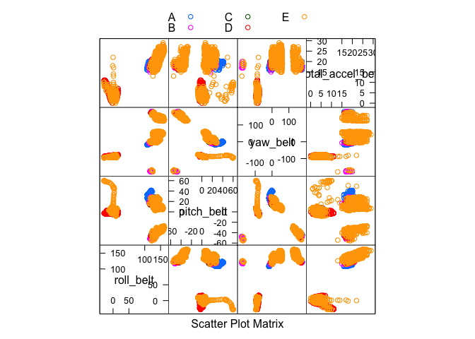
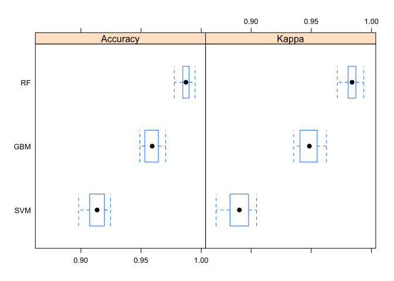

# PracticalMachineLearning
R. Debbe  
October 2, 2016  


This document reports the work done as project for the Coursera Practical Machine Learning where we were given data collected on six subjects that performed Weight Lifting Exercise "Bicep Curl-up" while wearing accelerometers mounted in one arm, one forearm and their  belt near the body's center of gravity. Results from that study were published and their data was made public. Details about that research can be found at: 
 <http://groupware.les.inf.puc-rio.br/har>

The following libraries were loaded to the session during this project:


```r
library(caret)
```

```
## Loading required package: lattice
```

```
## Loading required package: ggplot2
```

```r
library(mlbench)
```

# The original training and testing data sets


```r
training <- read.csv(file="../pml-training.csv", header=TRUE, sep=",")
testing  <- read.csv(file="../pml-testing.csv", header=TRUE, sep=",")
```
The training data has 19622 samples with 160 features. The test data set has only 20 samples with the same number of features but a considerable fraction of the test features have different data types as compared to the corresponding variables in the training set; they have been stored as logical vectors while the training set has them as factors. The followin snippet of the data summary shows such mismatch.


```
## 'data.frame':	19622 obs. of  6 variables:
##  $ skewness_roll_belt  : Factor w/ 395 levels "","-0.003095",..: 1 1 1 1 1 1 1 1 1 1 ...
##  $ skewness_roll_belt.1: Factor w/ 338 levels "","-0.005928",..: 1 1 1 1 1 1 1 1 1 1 ...
##  $ skewness_yaw_belt   : Factor w/ 2 levels "","#DIV/0!": 1 1 1 1 1 1 1 1 1 1 ...
##  $ max_roll_belt       : num  NA NA NA NA NA NA NA NA NA NA ...
##  $ max_picth_belt      : int  NA NA NA NA NA NA NA NA NA NA ...
##  $ max_yaw_belt        : Factor w/ 68 levels "","-0.1","-0.2",..: 1 1 1 1 1 1 1 1 1 1 ...
```

```
## 'data.frame':	20 obs. of  6 variables:
##  $ skewness_roll_belt  : logi  NA NA NA NA NA NA ...
##  $ skewness_roll_belt.1: logi  NA NA NA NA NA NA ...
##  $ skewness_yaw_belt   : logi  NA NA NA NA NA NA ...
##  $ max_roll_belt       : logi  NA NA NA NA NA NA ...
##  $ max_picth_belt      : logi  NA NA NA NA NA NA ...
##  $ max_yaw_belt        : logi  NA NA NA NA NA NA ...
```

These features found to have mismatched data types were then removed from both data sets:


```r
txt<- c(names(training))
reducedTraining<- training[, -grep("^kurtosis|^skewness|^max|^min|^avg|^var|^stddev|^amplitude", 
                                   txt, perl=TRUE, value=FALSE)]
txt<- c(names(testing))                                   
reducedTesting<- testing[, -grep("^kurtosis|^skewness|^max|^min|^avg|^var|^stddev|^amplitude", 
                                   txt, perl=TRUE, value=FALSE)]
```

The first 7 variables on both data sets have no prediction power and appear to have purely book-keeping puposes; they were also removed with:


```r
reducedTraining <- reducedTraining[, -c(1, 2, 3, 4, 5, 6, 7)]
reducedTesting  <- reducedTesting[, -c(1, 2, 3, 4, 5, 6, 7)]
```

The remaining 53 features appear as good candidates for predictor as their correlations are visible the following summary plot:

<!-- -->
We then divide the training data set in two sets to be able to do cross-validation as we fit several models.


```r
inTrain <- createDataPartition(y=reducedTraining$classe, p=0.5, list=FALSE)
subtraining <- reducedTraining[inTrain, ]
subtesting <- reducedTraining[-inTrain, ]

dim(subtraining)
```

```
## [1] 9812   53
```

```r
dim(subtesting)
```

```
## [1] 9810   53
```

We used the R package mlbench to compare three models: Random Forest (rf) with max number of trees set to 300, Boosted Random Forest (gbm) with default parameters, and a simpler classifier like Support Vector Machine (svm) also with default parameters. The comparison is done with 10 K-Fold cross validation and tree repeats:


```r
control <- trainControl(method="repeatedcv", number=10, repeats=3)
```

The actual training run overnight on OSX 'El Capitan' :


```r
set.seed(42)
svmModel<- train(classe ~., data=subtraining, method="svmRadial",  trControl=control)
```

```
## Loading required package: kernlab
```

```
## 
## Attaching package: 'kernlab'
```

```
## The following object is masked from 'package:ggplot2':
## 
##     alpha
```

```r
confusionMatrix(subtesting$classe, predict(svmModel, subtesting[,-53]))
```

```
## Confusion Matrix and Statistics
## 
##           Reference
## Prediction    A    B    C    D    E
##          A 2752    6   25    3    4
##          B  182 1622   86    3    5
##          C   23   93 1545   44    6
##          D   10    7  203 1385    3
##          E    3   17   84   57 1642
## 
## Overall Statistics
##                                           
##                Accuracy : 0.9119          
##                  95% CI : (0.9061, 0.9175)
##     No Information Rate : 0.3028          
##     P-Value [Acc > NIR] : < 2.2e-16       
##                                           
##                   Kappa : 0.8884          
##  Mcnemar's Test P-Value : < 2.2e-16       
## 
## Statistics by Class:
## 
##                      Class: A Class: B Class: C Class: D Class: E
## Sensitivity            0.9266   0.9295   0.7952   0.9283   0.9892
## Specificity            0.9944   0.9658   0.9789   0.9732   0.9802
## Pos Pred Value         0.9864   0.8546   0.9030   0.8613   0.9107
## Neg Pred Value         0.9689   0.9845   0.9509   0.9870   0.9978
## Prevalence             0.3028   0.1779   0.1981   0.1521   0.1692
## Detection Rate         0.2805   0.1653   0.1575   0.1412   0.1674
## Detection Prevalence   0.2844   0.1935   0.1744   0.1639   0.1838
## Balanced Accuracy      0.9605   0.9476   0.8870   0.9507   0.9847
```

```r
set.seed(42)
gbmModel<- train(classe ~., data=subtraining, method="gbm", verbose=FALSE, trControl=control)
```

```
## Loading required package: gbm
```

```
## Loading required package: survival
```

```
## 
## Attaching package: 'survival'
```

```
## The following object is masked from 'package:caret':
## 
##     cluster
```

```
## Loading required package: splines
```

```
## Loading required package: parallel
```

```
## Loaded gbm 2.1.1
```

```
## Loading required package: plyr
```

```r
confusionMatrix(subtesting$classe, predict(gbmModel, subtesting[,-53]))
```

```
## Confusion Matrix and Statistics
## 
##           Reference
## Prediction    A    B    C    D    E
##          A 2728   34   21    3    4
##          B   80 1754   59    4    1
##          C    0   52 1625   31    3
##          D    0   11   57 1532    8
##          E    3   18   23   23 1736
## 
## Overall Statistics
##                                           
##                Accuracy : 0.9557          
##                  95% CI : (0.9514, 0.9596)
##     No Information Rate : 0.2865          
##     P-Value [Acc > NIR] : < 2.2e-16       
##                                           
##                   Kappa : 0.9439          
##  Mcnemar's Test P-Value : 2.199e-15       
## 
## Statistics by Class:
## 
##                      Class: A Class: B Class: C Class: D Class: E
## Sensitivity            0.9705   0.9385   0.9104   0.9617   0.9909
## Specificity            0.9911   0.9819   0.9893   0.9908   0.9917
## Pos Pred Value         0.9778   0.9241   0.9497   0.9527   0.9628
## Neg Pred Value         0.9882   0.9855   0.9802   0.9926   0.9980
## Prevalence             0.2865   0.1905   0.1820   0.1624   0.1786
## Detection Rate         0.2781   0.1788   0.1656   0.1562   0.1770
## Detection Prevalence   0.2844   0.1935   0.1744   0.1639   0.1838
## Balanced Accuracy      0.9808   0.9602   0.9498   0.9762   0.9913
```

```r
set.seed(42)
rfModel_0p5_tree300<- train(classe ~., data=subtraining, method="rf", ntree = 300, trControl=control)
```

```
## Loading required package: randomForest
```

```
## randomForest 4.6-12
```

```
## Type rfNews() to see new features/changes/bug fixes.
```

```
## 
## Attaching package: 'randomForest'
```

```
## The following object is masked from 'package:ggplot2':
## 
##     margin
```

```r
confusionMatrix(subtesting$classe, predict(rfModel_0p5_tree300, subtesting[,-53]))
```

```
## Confusion Matrix and Statistics
## 
##           Reference
## Prediction    A    B    C    D    E
##          A 2781    0    7    1    1
##          B   24 1864    9    1    0
##          C    0   22 1689    0    0
##          D    0    0   54 1552    2
##          E    0    0    1    4 1798
## 
## Overall Statistics
##                                           
##                Accuracy : 0.9872          
##                  95% CI : (0.9847, 0.9893)
##     No Information Rate : 0.2859          
##     P-Value [Acc > NIR] : < 2.2e-16       
##                                           
##                   Kappa : 0.9838          
##  Mcnemar's Test P-Value : NA              
## 
## Statistics by Class:
## 
##                      Class: A Class: B Class: C Class: D Class: E
## Sensitivity            0.9914   0.9883   0.9597   0.9961   0.9983
## Specificity            0.9987   0.9957   0.9973   0.9932   0.9994
## Pos Pred Value         0.9968   0.9821   0.9871   0.9652   0.9972
## Neg Pred Value         0.9966   0.9972   0.9912   0.9993   0.9996
## Prevalence             0.2859   0.1923   0.1794   0.1588   0.1836
## Detection Rate         0.2835   0.1900   0.1722   0.1582   0.1833
## Detection Prevalence   0.2844   0.1935   0.1744   0.1639   0.1838
## Balanced Accuracy      0.9951   0.9920   0.9785   0.9947   0.9989
```

As was already mentioned by the instructor, Random Forest is the best classifier as it achieved the highest accuracy as shown in the plot below:


```r
comparisons <- resamples(list(RF=rfModel_0p5_tree300, GBM=gbmModel, SVM=svmModel))
summary(comparisons)
```

```
## 
## Call:
## summary.resamples(object = comparisons)
## 
## Models: RF, GBM, SVM 
## Number of resamples: 30 
## 
## Accuracy 
##       Min. 1st Qu. Median   Mean 3rd Qu.   Max. NA's
## RF  0.9776  0.9847 0.9873 0.9870  0.9898 0.9949    0
## GBM 0.9490  0.9534 0.9592 0.9589  0.9643 0.9705    0
## SVM 0.8981  0.9072 0.9134 0.9126  0.9193 0.9246    0
## 
## Kappa 
##       Min. 1st Qu. Median   Mean 3rd Qu.   Max. NA's
## RF  0.9716  0.9806 0.9839 0.9835  0.9871 0.9936    0
## GBM 0.9354  0.9410 0.9484 0.9480  0.9549 0.9626    0
## SVM 0.8708  0.8824 0.8903 0.8892  0.8976 0.9045    0
```

```r
bwplot(comparisons)
```

<!-- -->

Some time was invested in exploring the parameter space to the 'rf' model but was not pursued beyon the maximum number of trees set at 300 because the resulting accurarcy was not improving much beyond that value.

# Out of sample error

Our best model, Random Forest has an accuracy of 0.9876 the expected error for out of sample prediction is thus (1 - accuracy)*100 = 1.24%

We can get a better estimate using cross-validation by looking at the details of the fit to the rf model:


```r
rfModel_0p5_tree300$finalModel
```

```
## 
## Call:
##  randomForest(x = x, y = y, ntree = 300, mtry = param$mtry) 
##                Type of random forest: classification
##                      Number of trees: 300
## No. of variables tried at each split: 2
## 
##         OOB estimate of  error rate: 1.22%
## Confusion matrix:
##      A    B    C    D    E class.error
## A 2784    4    2    0    0 0.002150538
## B   19 1868   12    0    0 0.016324381
## C    0   20 1688    3    0 0.013442431
## D    0    0   44 1559    5 0.030472637
## E    1    1    4    5 1793 0.006097561
```
where the out-of-sample error is quoted as 1.15%

# Predict the outcome of the test data set

As mentioned above, the test data set was prepared in the same manner as the training set. Using our best model (Random Forest) we get the following outcome:


```r
results <- predict(rfModel_0p5_tree300, reducedTesting[,-53])
```
# Acknowledgement:
We used the data collected by the Human Activity Research project:
Ugulino, W.; Cardador, D.; Vega, K.; Velloso, E.; Milidiu, R.; Fuks, H. Wearable Computing: Accelerometers' Data Classification of Body Postures and Movements. Proceedings of 21st Brazilian Symposium on Artificial Intelligence. Advances in Artificial Intelligence - SBIA 2012. In: Lecture Notes in Computer Science. , pp. 52-61. Curitiba, PR: Springer Berlin / Heidelberg, 2012. ISBN 978-3-642-34458-9. DOI: 10.1007/978-3-642-34459-6_6.
